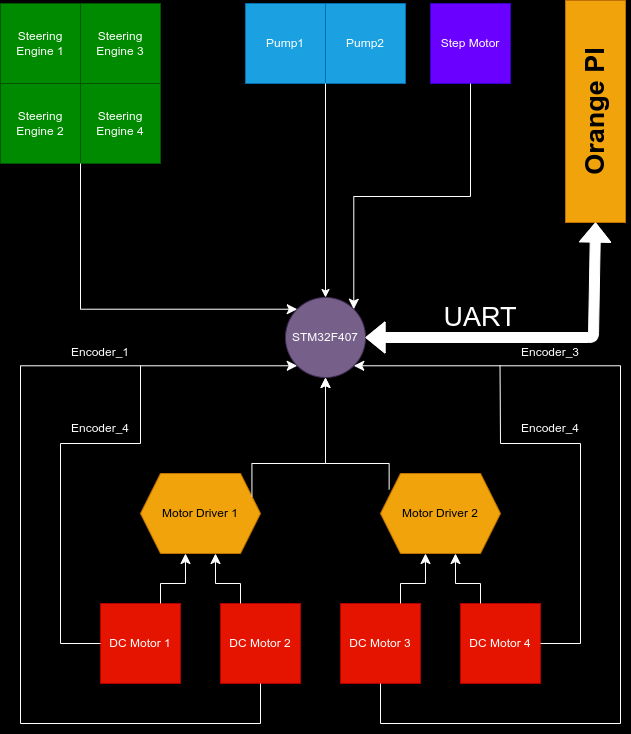

# EatNoLine_Robot

Main STM32F4x Project for RoboGame 2024

## Pin Connection Configuration

### Connection Diagram

### DC Motor

| Motor | PWM (TIMER-CHANNEL) | EN_A | EN_B | Encoder_A | Encoder_B |
| ----- | ------------------- | ---- | ---- | --------- | --------- |
| M1    | PA2 (TIM5-CH3)      | PC4  | PF1  | PE9       | PE11      |
| M2    | PA3 (TIM5-CH4)      | PC5  | PF2  | PA5       | PA1       |
| M3    | PE5 (TIM9-CH1)      | PF11 | PF3  | PA6       | PA7       |
| M4    | PE6 (TIM9-CH2)      | PF12 | PF4  | PD12      | PD13      |

### Steering Engine

| SteeringEngine | PWM (TIMER-CHANNEL) |
| -------------- | -------------------- |
| SE1            | PC6 (TIM8-CH1)       |
| SE2            | PC7 (TIM8-CH2)       |
| SE3            | PC8 (TIM8-CH3)       |
| SE4            | PC9 (TIM8-CH4)       |

### Step Motor

| StepMotor | Pulse (TIMER-CHANNEL) | Enable | Direction |
| --------- | ---------------------- | ------ | --------- |
| StepMotor | PF7 (TIM11-CH1)        | PE10   | PE12      |

### Pump Controller

| Pump  | Pinout |
| ----- | ------ |
| Pump1 | PF13   |
| Pump2 | PF14   |

## Power Supply Management

